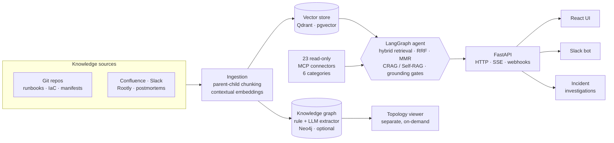

<div align="center">

# OpsRAG

### Agentic GraphRAG for DevOps & SRE

Turn your runbooks, Terraform, Helm charts, Kubernetes manifests, and incident
postmortems into **cited, trustworthy answers** — and let an agent run
**autonomous incident investigations** against your live telemetry.

<br/>

[](https://github.com/dtduc-git/opsrag/actions/workflows/ci.yml)
[](https://github.com/dtduc-git/opsrag/actions/workflows/security.yml)
[](docs/evaluation.md)
[](LICENSE)
[](pyproject.toml)
[](#status)
[](CONTRIBUTING.md)

<br/>

**[Quickstart](#-quickstart)** &nbsp;·&nbsp;
**[Documentation](docs/README.md)** &nbsp;·&nbsp;
**[Architecture](docs/architecture.md)** &nbsp;·&nbsp;
**[Configuration](docs/configuration.md)** &nbsp;·&nbsp;
**[Deploy](docs/deployment.md)**

</div>

---

OpsRAG is an open-source, vendor-neutral retrieval system built for SRE and
platform teams. It bundles a LangGraph agent, a pluggable vector-retrieval
pipeline (with 23 opt-in, categorized MCP connectors) plus an optional Neo4j
knowledge graph that captures service/dependency relationships, a FastAPI
surface with OIDC/SSO auth, a React UI, chat bots for Slack/Telegram/Discord/Teams
(with image understanding), an evaluation harness, a first-class Helm chart, and a
one-command local stack.

Every answer is **grounded and cited**. A new evaluator goes from `git clone`
to a cited answer in **under fifteen minutes** — no Kubernetes, no cloud
account, and no external identity provider required.

## ✨ Features

|  |  |
|---|---|
| 🔎 **Hybrid retrieval** | Dense + BM25 + a code-aware lane, fused with Reciprocal Rank Fusion and diversified with MMR. |
| 🧠 **Agentic RAG** | LangGraph agent with CRAG / Self-RAG, anti-hallucination grounding gates, and a semantic answer cache. |
| 🕵️ **Incident investigations** | An event-driven engine that forms hypotheses and verifies them against live telemetry, with resumable SSE and a hard budget. |
| 💬 **Chat bots** | Talk to OpsRAG from Slack, Telegram, Discord, and Teams — same agent, allowlist/scoped, with a read-only web view of shared-channel conversations. |
| 🖼️ **Image understanding** | Attach a screenshot or diagram on the web UI or any channel bot — ephemeral, vision pass-through with provider-aware auto-routing to a vision model when the active one can't see (bytes are never persisted). |
| 🔌 **23 MCP connectors** | Read-only, opt-in connectors, grouped by category — Cloud (AWS, Azure, GCP, Cloudflare), Observability (Prometheus, Datadog, Grafana, Loki, Splunk, Sentry, Elasticsearch, CloudWatch, Stackdriver), Source & Code (GitHub, GitLab), Incident Management (PagerDuty, Rootly, Slack), Kubernetes, and the local knowledge base. |
| 🌍 **Multi-environment** | One instance targeting many environments' Kubernetes / Prometheus / Elasticsearch via a single `environments:` registry. |
| 🔐 **Auth built in** | first-party `login` (default) / `oidc` modes, SSO (Google · GitHub · Microsoft), a seeded admin account, per-session ownership, optional Redis rate limiting. |
| 🧩 **Pluggable everything** | Vector store, knowledge graph, and LLM / embedding / reranker providers are all swappable from config — no rebuild. |
| 📊 **Observability** | Per-request token + cost telemetry, Phoenix / OTLP traces, and an evaluation harness wired into CI gates. |
| 📏 **Runnable eval** | A two-tier golden eval over the shipped `samples/` corpus — an offline, no-secrets gate that scores the default core retrieval path (Dense + BM25 RRF + local rerank; no MMR/judge) via `pytest tests/integration/test_eval_samples_retrieval.py`, plus a full answer-quality judge (`python -m opsrag.eval run`). The badge reports hybrid recall@5 on `samples/`, not a full-pipeline number. |

## 🏗️ Architecture



> **On "GraphRAG."** The vector-retrieval lane (dense + BM25 + code-aware,
> fused with RRF and diversified with MMR) is what answers a `/query`. OpsRAG
> has **two distinct graphs**, neither of which is the main retrieval path:
> - The **Neo4j knowledge graph** captures relationships between services,
>   libraries, features, and dependencies. It is built at ingest by a hybrid
>   rule + LLM extractor (the default — set `entity_extraction.method:
>   rule_based` for a fully deterministic, no-LLM build). It powers the
>   topology viewer and is **not** consulted during vector retrieval.
> - An optional **light entity-graph** (Postgres, zero-LLM rule-based) adds a
>   1-hop entity expansion to retrieval when `light_graph.enabled: true`. It is
>   **off by default**, so by default vector retrieval consults no graph at all.

See [docs/architecture.md](docs/architecture.md) for the request flow, the
provider seams, and the investigation engine.

## 🚀 Quickstart

**Prerequisites:** Docker (Compose v2), `curl`, `jq`, and one LLM API key
(default: Anthropic). You do **not** need Kubernetes, an external OIDC provider
(Dex is bundled), or any cloud account.

```sh
# 1. Clone and set your LLM key
git clone https://github.com/dtduc-git/opsrag.git
cd opsrag
cp .env.example .env
# Edit .env: set ANTHROPIC_API_KEY=...   (every other value can stay default)

# 2. Bring up the stack:
#    API :8080 · UI :5173 · Qdrant · Postgres · Dex (OIDC :5556) · Phoenix :6006
docker compose -f deploy/compose/docker-compose.yaml up -d --build

# 3. Verify health (readiness flips to 200 once Postgres + Qdrant are up)
curl -sf http://localhost:8080/healthz
curl -sf http://localhost:8080/readyz

# 4. Index the bundled sample corpus (the fictional "Acme Notes" product)
docker compose -f deploy/compose/docker-compose.yaml exec opsrag-api \
  scripts/seed-sample-corpus.sh

# 5. Log in. The compose demo runs in LOGIN mode (the default), so the API
#    enforces auth: open the web UI at http://localhost:5173 and you will hit
#    the SIGN-IN screen. Log in as the seeded admin — by default
#    admin@opsrag.local with the password from your .env
#    (OPSRAG_ADMIN_EMAIL / OPSRAG_ADMIN_PASSWORD). To drive the API directly,
#    grab a session cookie:
curl -sf -X POST http://localhost:8080/auth/login \
  -d "email=admin@opsrag.local" -d "password=$OPSRAG_ADMIN_PASSWORD" \
  -c cookies.txt

# 6. Ask a question (authenticated with the session cookie from step 5):
curl -sf -X POST http://localhost:8080/query -b cookies.txt \
  -H 'Content-Type: application/json' \
  -d '{"query":"How do I roll back an Acme Notes deployment?"}' | jq
```

You get back a cited answer drawn from the indexed `samples/` corpus, plus a
`session_id` and a `trace_id`. Open the web UI at <http://localhost:5173>, or
inspect the full LangGraph trace in Phoenix at <http://localhost:6006>.

> **Using an external IdP instead?** Switch to `oidc` mode and point OpsRAG at
> your IdP. The bundled Dex (`:5556`) illustrates that path — mint a token with
> the resource-owner password grant and send it as a Bearer:
>
> ```sh
> TOKEN=$(curl -sf -X POST \
>   -d 'grant_type=password' \
>   -d 'username=evaluator@example.com' -d 'password=evaluator' \
>   -d 'client_id=opsrag-local' -d 'client_secret=local-secret' \
>   -d 'scope=openid profile email' \
>   http://localhost:5556/dex/token | jq -r .access_token)
>
> curl -sf -X POST http://localhost:8080/query \
>   -H "Authorization: Bearer $TOKEN" -H 'Content-Type: application/json' \
>   -d '{"query":"How do I roll back an Acme Notes deployment?"}' | jq
> ```

> **Heads-up:** the bundled Dex advertises its issuer as
> `http://localhost:5556/dex` while the API reaches it in-cluster at
> `http://dex:5556/dex`. On an issuer-mismatch error, align both sides — see
> [docs/auth.md](docs/auth.md).

The full walkthrough lives in
[`docs/getting-started.md`](docs/getting-started.md).

## 🔑 Authentication: the admin user vs. the Dex user

Authentication is **always enforced** — there is no anonymous / "open" mode.
The seeded `admin@opsrag.local` account and the Dex `evaluator@example.com`
token belong to **two different auth modes** — a common point of confusion.
OpsRAG has two:

| Mode | Who proves identity | First-party users? | Used by |
|---|---|---|---|
| `login` *(default)* | OpsRAG's own login: password + SSO (Google/GitHub/Microsoft) + cookies | **Yes** — including the bootstrap **`admin@opsrag.local`** | the **compose demo** and first-party deployments |
| `oidc` | an **external IdP** issues a Bearer token; OpsRAG only *validates* it | **No local credentials** — identity is asserted by the token; OpsRAG still records each identity in its `opsrag_user` table and resolves roles from the token's `groups` claim | the **Dex** illustration above; in production, your Okta / Entra / Google |

**The key point.** The compose demo runs in `login` mode, so the web UI shows a
**sign-in screen** and you log in as the seeded **`admin@opsrag.local`**
account. `oidc` mode has no *built-in* admin **account** — but it absolutely has
**admins**: identity comes from the token, and OpsRAG grants the `admin` role to
any user whose IdP `groups` / `roles` claim is mapped to it via
**`auth.role_mappings`** (e.g. `{"sre-admins": ["admin"]}` — the `admin` role
bundles every scope). So the seeded `admin@opsrag.local` (login) and a
Dex / Okta user (oidc) reach admin by **different paths** — a local password vs.
an IdP group — but both are real admins, and OpsRAG records every authenticated
identity in `opsrag_user` regardless of mode. You do **not** need `login` mode to
have an admin under `oidc`; you grant it through your IdP. (Full role-mapping
setup: [docs/auth.md](docs/auth.md).)

**The admin user.** There is no pre-baked password to retrieve — you set it.
OpsRAG **seeds** the admin (role `admin`, idempotent) on boot in `login` mode
from your env (never inline in config); the compose demo defaults to
`admin@opsrag.local`:

```sh
# .env (login mode is the default — no config.yaml change needed)
OPSRAG_SESSION_SIGNING_KEY=<32+ random bytes>      # signs session cookies
OPSRAG_ADMIN_EMAIL=admin@opsrag.local
OPSRAG_ADMIN_PASSWORD=<choose-a-strong-password>
```

Log in via the web UI's sign-in screen, or `POST /auth/login` to get a session
cookie (see the Quickstart). For an `http://localhost` demo the session cookie
must be sent over plain HTTP, so set `cookie_secure: false` in that case. Full
steps (SSO, refresh tokens, RBAC, the `oidc` setup) are in
[docs/auth.md](docs/auth.md), which covers both modes end to end.

## 🧭 Documentation

Full docs are in **[`docs/`](docs/README.md)**. Start here:

| Guide | What it covers |
|---|---|
| [Getting started](docs/getting-started.md) | Clone → run → index → first query → enable auth → first investigation. |
| [Configuration](docs/configuration.md) | The config model, `env > YAML > bundle` precedence, secrets, and every config block. |
| [Architecture](docs/architecture.md) | Component map, the `/query` request flow, and the provider seams. |
| [RAG pipeline](docs/rag-pipeline.md) | Ingestion, chunking, hybrid retrieval, reranking, CRAG/Self-RAG, and the answer cache. |
| [Evaluation](docs/evaluation.md) | The two-tier golden eval over `samples/`: the offline retrieval gate (no secrets) and the answer-quality judge. |
| [Investigations](docs/investigations.md) | The event-driven incident-investigation engine. |
| [MCP integrations](docs/mcp-integrations.md) | The 23 read-only connectors, organized by category, with their env vars and the safety model. |
| [Multi-environment](docs/multi-environment.md) | One instance, many environments' Kubernetes / Prometheus / Elasticsearch. |
| [Authentication](docs/auth.md) · [Operations](docs/operations.md) · [API reference](docs/api-reference.md) | Auth modes + SSO, day-2 ops, and the HTTP/SSE surface. |

## ⚙️ Configuration

OpsRAG is driven by a single `config.yaml` (Pydantic-v2 validated) plus
environment variables for secrets. The default config boots a healthy service
with **zero MCP integrations** and a **null knowledge graph** — only an LLM API
key and the bundled local OIDC issuer are required. Each integration is opt-in:

```yaml
mcp:
  prometheus:
    enabled: true   # required env: PROMETHEUS_URL, PROMETHEUS_BEARER_TOKEN
  datadog:
    enabled: false
```

Missing credentials for an enabled integration produce a named, fail-fast
startup error (`MCP_MISCONFIGURED:<name>:<env>`). See
[docs/configuration.md](docs/configuration.md).

## ☸️ Deploying with Helm

```sh
helm install opsrag deploy/helm/opsrag \
  -f my-values.yaml --namespace opsrag --create-namespace
```

Ready-made scenario values live in `deploy/helm/opsrag/`: `values-gcp.yaml`,
`values-aws.yaml`, `values-mcp.yaml`, `values-multi-env.yaml`,
`values-minimal.yaml`. See the [Helm chart reference](docs/helm-chart.md) and
the [Deployment guide](docs/deployment.md).

## 🗂️ Project layout

```text
opsrag/                  Python backend package
  agent/                 Core LangGraph RAG agent (4 topologies)
  investigations/        Event-driven incident-investigation engine
  api/                   FastAPI surface (HTTP + SSE + webhooks)
  auth/                  OIDC / SSO / first-party login
  mcp/                   23 MCP connectors (6 categories), each opt-in
  environments.py        Multi-environment registry resolver
ui/                      React single-page UI (Vite)
deploy/
  helm/opsrag/           First-class Helm chart
  compose/               Local docker-compose stack (incl. Dex)
samples/                 Synthetic corpus for the quickstart
scripts/                 Audit, seed, and helper scripts
tests/                   contract / integration / unit
```

## Status

> **Pre-release (`0.1.0a0`).** The first public release is being assembled on
> `master`. Interfaces and configuration keys may change without notice until
> `v0.1.0`.

## 🤝 Contributing

See [CONTRIBUTING.md](CONTRIBUTING.md) for the PR workflow and the mandatory
checks (lint, types, tests, vendor-neutrality audit, helm-lint, and the
always-on, no-secrets `eval-offline` retrieval gate). `master` is protected:
every PR must pass the required checks before it can merge.

## 🔒 Security

Report vulnerabilities through the process in [SECURITY.md](SECURITY.md).
Please do not file public issues for security findings.

## 📄 License

Apache License 2.0 — see [LICENSE](LICENSE) and [NOTICE](NOTICE).
